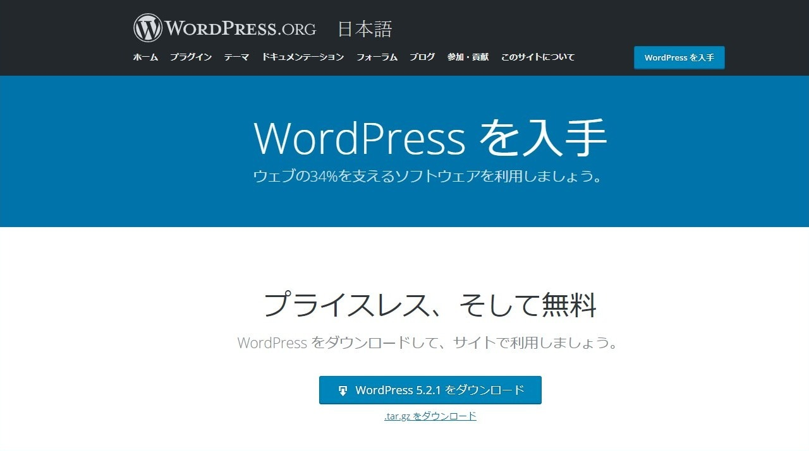

### 第2回　Wordpressを入れたサイトを作ってみよう。

+++

### 目次
 - [@color[white](WPの準備)](https://gitpitch.com/RyoMiyano/lets_wordpress/setti) 
 - [@color[white](データベースを作ろう)](https://gitpitch.com/RyoMiyano/lets_wordpress/setti) 
 - [@color[white](FTPを使おう)](https://gitpitch.com/RyoMiyano/lets_wordpress/setti) 
 - [@color[white](設定を行おう)](https://gitpitch.com/RyoMiyano/lets_wordpress/setti) 
 
+++

 宮野くん
>Wordpressをダウンロードしてきたら、無料って事やけど、とりあえずどうすればいいの？

+++

### まず、ホームページには基本的にURL（ドメイン）とサーバーが必要です。

+++

 宮野くん
>じゃあ、ドメインとレンタルサーバーを契約してきまーす。

+++

## ちょっとまって下さい。

+++

### Wordpressを入れたサイトを作るにはデータベースが必要です。

+++

### そのため、サーバーはスペックを見てちゃんと選んで下さいね。
※使いたいWPバージョンの推奨スペックを確認、特にPHP

+++

 宮野くん
>データベースが使えるサーバーかあ。。

+++

 宮野くん
>激安サーバーだとだめか・・くそう・・・

+++

### 比較的安価なサクラサーバーやXサーバーで問題ないでしょう。
※googleのサービスで無料で作る事も可能

+++

 宮野くん
>じゃあ、今回はサクラサーバーと・・・

+++

 宮野くん
>ドメインはサクラサーバーの無料のサブドメインでいいや

+++

### まあ、問題は無いでしょう。
※ちゃんとしたホームページを作るならドメインはちゃんと契約しましょう。

+++

### それでは、さっそく
### Wordpressの元をダウンロードしましょう。

+++

 宮野くん
>待ってました！

+++

### Wordpresのサイトにアクセスしてダウンロードして下さい。

+++

 2019年6月の画面

+++

### ダウンロードできたら、やっと準備が整いました。

+++

 宮野くん
>ドメインとサーバーとWPの元！

+++

### 簡単にやる事は  
 - ①サクラサーバーにWP用のデータベースを作る|
 - ②WPの元をFTP繋げてアップロード|
 - ③データベースとWPの元を繋げる（設定）|
 - ※ドメインなどの設定は割愛します。|
 
+++

 宮野くん
>けっこうややこしいね。

+++

### ややこしいけど何度か繰り返せば簡単にできます。
 
+++

### 今回は手動で行いますがサクラサーバーなどでしたら
### ワンクリックで全て出来てしまうような事も可能です。
 
+++

 宮野くん
>勉強のために手動で行います！

+++

### よろしい！では早速ですがサクラサーバーの管理画面にアクセス！
 
+++

### 次回に続く
 - [@color[white](目次へ)](https://gitpitch.com/RyoMiyano/lets_wordpress/setti) 
 

