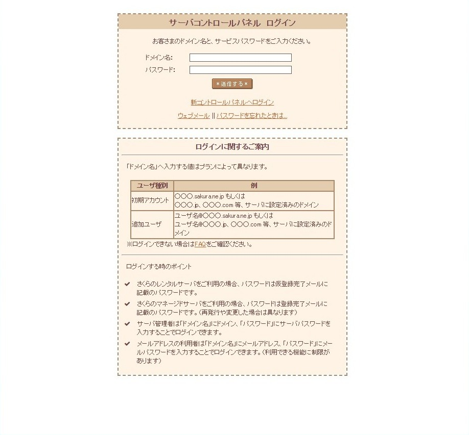
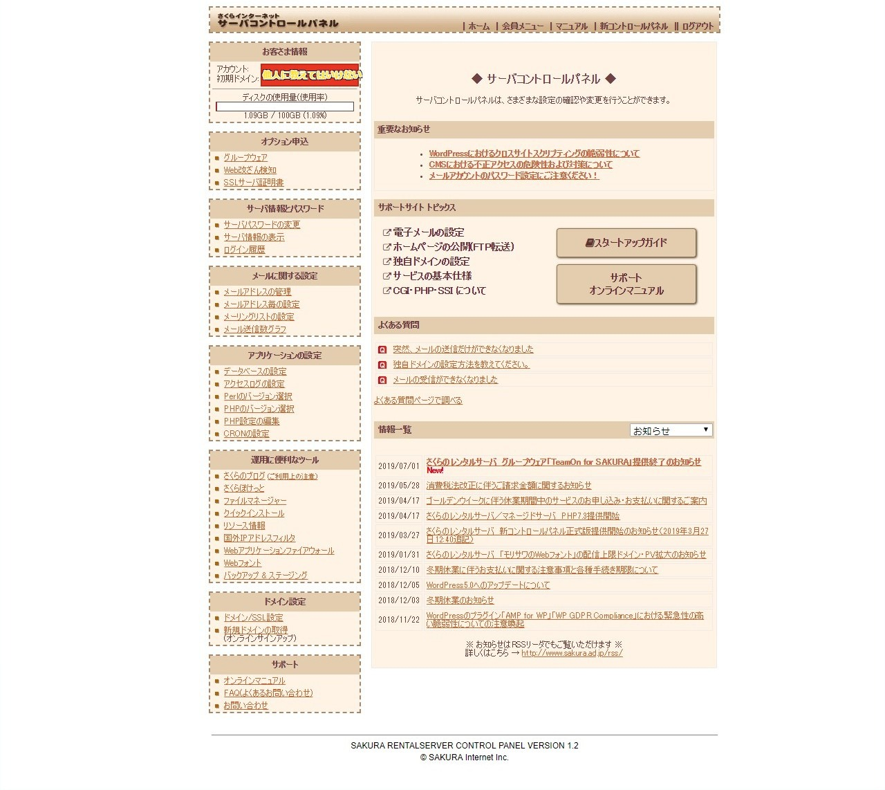
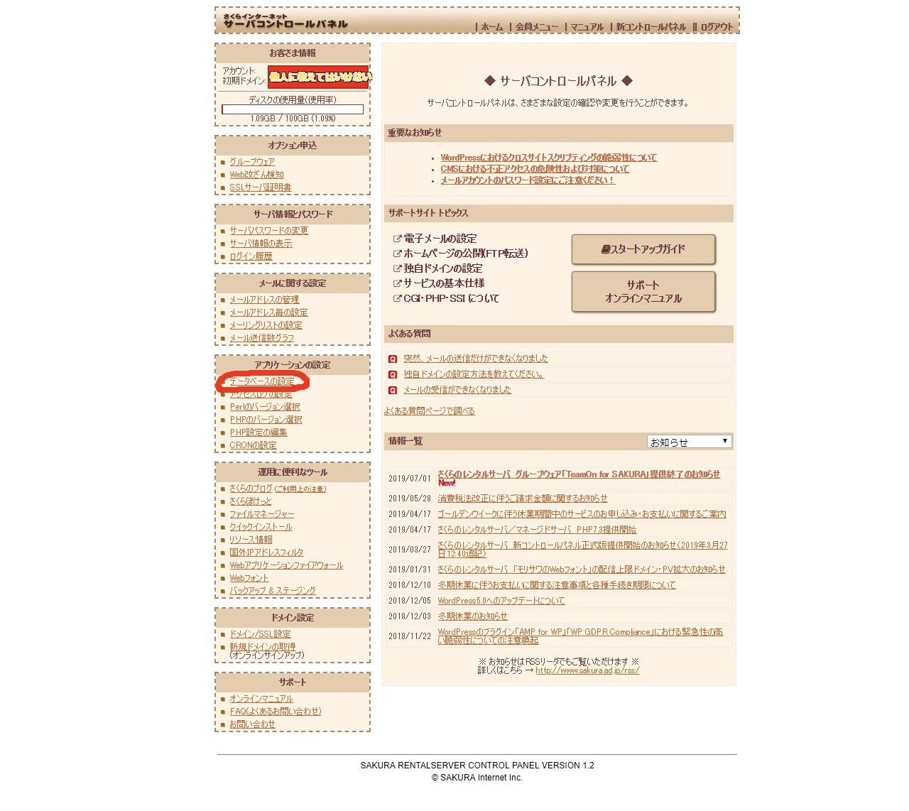
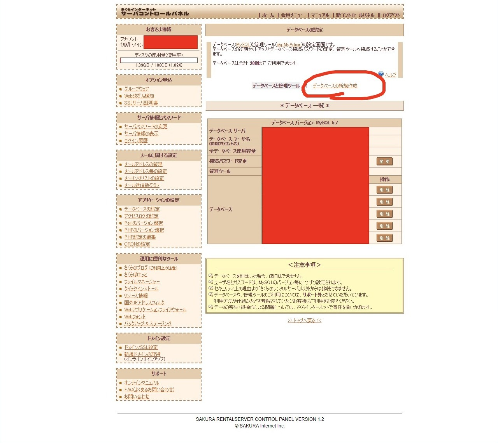
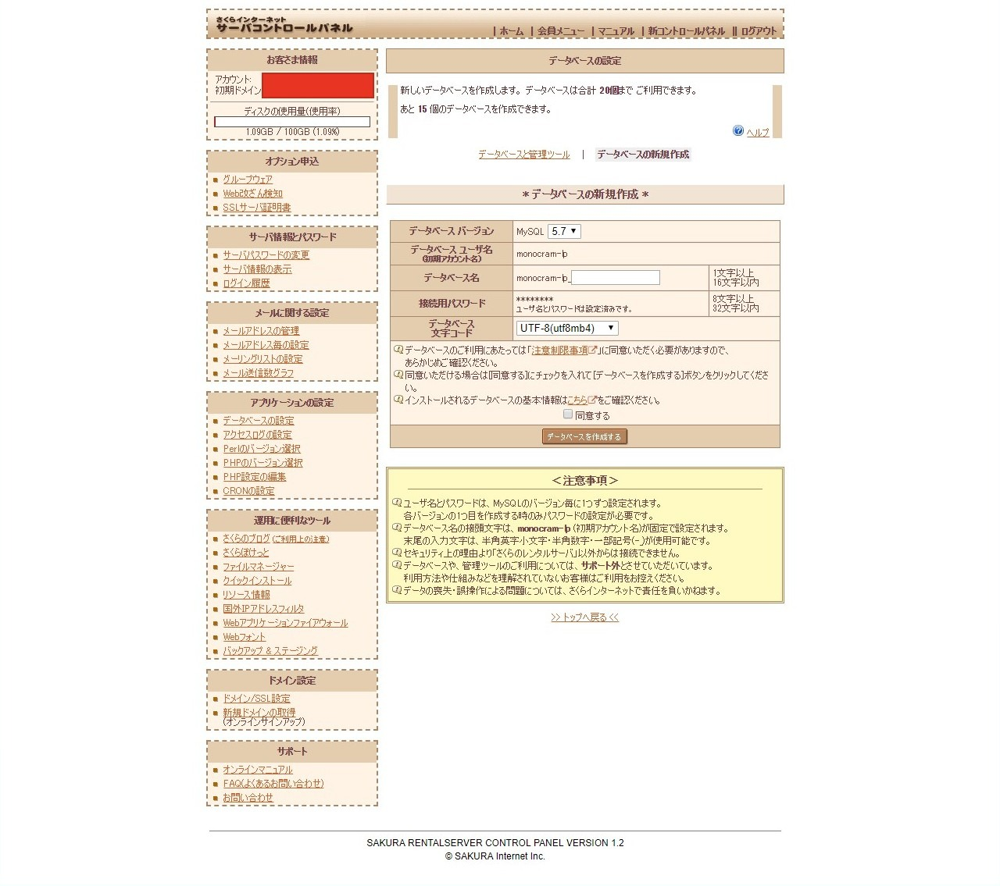

### 第2回　Wordpressを入れたサイトを作ってみよう。

+++

### 目次

 - [@color[white](WPの準備)](https://gitpitch.com/RyoMiyano/lets_wordpress/setti#/0/2) |
 - [@color[white](データベースを作ろう)](https://gitpitch.com/RyoMiyano/lets_wordpress/datebase#/0/2) |
 - [@color[white](FTPを使おう)](https://gitpitch.com/RyoMiyano/lets_wordpress/ftp#/0/2) |
 - [@color[white](設定を行おう)](https://gitpitch.com/RyoMiyano/lets_wordpress/settei#/0/2) |
 
+++

### データベースを作ろう

+++

 宮野くん
>さくらサーバー契約してきましたよ！

+++

### なら、契約したメールアドレスにログインまでの方法が記載されていると思うのでメールを見てください。

+++

 宮野くん
>わかりました。

+++

 ログイン画面

+++

### さくらサーバーのログイン画面です。契約したサーバーによってデザインが違います。

+++

 コンパネのホーム

+++

### メニューが並んでいて行いたい事をクリックして選びましょう。

+++

 赤枠の部分

+++

### 今回はWPを作るためにデータベースが欲しいのでデータベースの設定をクリック

+++

### すると・・・

+++

 データベースの設定はこんな感じ

+++

 宮野くん
>ほほお・・・

+++

### データベースの新規作成をクリックします。

+++

 入力欄が出てきます。

+++

### 入力していきましょう。

+++

 入力欄が出てきます。

+++

 - ### MySQLバージョン 
 - データベースの種類とバージョンです。今回はそのままでOK | 
 
+++

### Wordpresのサイトにアクセスしてダウンロードして下さい。

+++

 2019年6月の画面

+++

### ダウンロードできたら、やっと準備が整いました。

+++

 宮野くん
>ドメインとサーバーとWPの元！

+++

### 簡単にやる事は  
 - ①サクラサーバーにWP用のデータベースを作る|
 - ②WPの元をFTP繋げてアップロード|
 - ③データベースとWPの元を繋げる（設定）|
 - ※ドメインなどの設定は割愛します。|
 
+++

 宮野くん
>けっこうややこしいね。

+++

### ややこしいけど何度か繰り返せば簡単にできます。
 
+++

### 今回は手動で行いますがサクラサーバーなどでしたら
### ワンクリックで全て出来てしまうような事も可能です。
 
+++

 宮野くん
>勉強のために手動で行います！

+++

### よろしい！では早速ですがサクラサーバーの管理画面にアクセス！
 
+++

### 次回に続く
 - [@color[white](目次へ)](https://gitpitch.com/RyoMiyano/lets_wordpress/setti#/0/1) 
 

