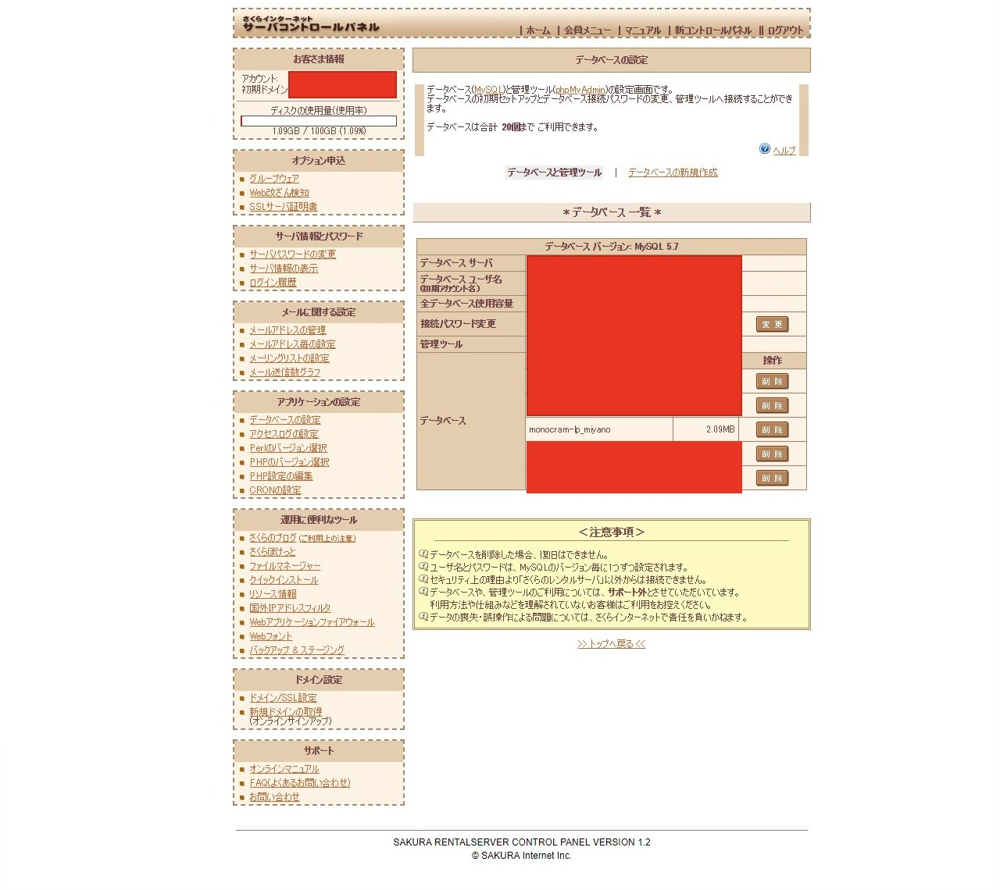

### 第2回　Wordpressを入れたサイトを作ってみよう。

+++

### 目次

 - [@color[white](WPの準備)](https://gitpitch.com/RyoMiyano/lets_wordpress/setti#/0/2) |
 - [@color[white](データベースを作ろう)](https://gitpitch.com/RyoMiyano/lets_wordpress/datebase#/0/2) |
 - [@color[white](FTPを使おう)](https://gitpitch.com/RyoMiyano/lets_wordpress/ftp#/0/2) |
 - [@color[white](設定を行おう)](https://gitpitch.com/RyoMiyano/lets_wordpress/settei#/0/2) |
 
+++

### データベースを作ろう

+++

 宮野くん
>さくらサーバー契約してきましたよ！

+++

### なら、契約したメールアドレスにログインまでの方法が記載されていると思うのでメールを見てください。

+++

 宮野くん
>わかりました。

+++

 ログイン画面

+++

### さくらサーバーのログイン画面です。契約したサーバーによってデザインが違います。

+++

 コンパネのホーム

+++

### メニューが並んでいて行いたい事をクリックして選びましょう。

+++

 赤枠の部分

+++

### 今回はWPを作るためにデータベースが欲しいのでデータベースの設定をクリック

+++

### すると・・・

+++

 データベースの設定はこんな感じ

+++

 宮野くん
>ほほお・・・

+++

### データベースの新規作成をクリックします。

+++

 入力欄が出てきます。

+++

### 入力していきましょう。

+++

 入力欄が出てきます。

+++

 ### MySQLバージョン 
 - データベースの種類とバージョンです。今回はそのままでOK | 
 - というか安いプランなので選べませんでした。 | 
 - ついでに201906現在のmysql最新バージョンは8.0.16です。 |  
 
+++

 ### データベースユーザ名
 - さくらは規定があるため設定不要です。 | 
 - 他のサーバーは設定する事があるので設定してください。 | 

+++

 ### データベース名
 - 基本的にはプロジェクトの名前を入力します。 | 
 - 今回はmiyanoと入力しました。 | 

+++

 ### 接続用パスワード
 - さくらは規定があるため設定不要です。 | 
 - 他のサーバーは設定する事があるので設定してください。 | 

+++

 ### データベース文字コード
 - この部分も設定不要です。 | 
 - 文字コードについて知りたい方はWEBで検索！ | 

+++

### 設定ができたらデータベースを作成します。
※ユーザ名やパスワードは大事なので何かに残しておいてください。

+++

 こんな感じで作成されてます。

+++

 宮野くん
>できた！
 
+++

### データベースはこれで作成できました。次はFTPです。

+++

### 次回に続く
 - [@color[white](目次へ)](https://gitpitch.com/RyoMiyano/lets_wordpress/setti#/0/1) 
 

